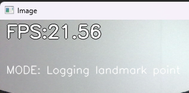

# Hand Tracking Capture (Python3)

### Watch [Demo Video](https://www.youtube.com/watch?v=ocB7OnGq14M)
<a href="https://youtu.be/ocB7OnGq14M"></a>

This Python project can run alone. This program will use your camera and will process the image into landmarks. The landmarks can be used for training the hand gesture recognition model. 

### Requirements
- Python3.9 (this is the specific version that I use on this project)

### Installation
- Use the venv

Linux:
```commandline
source venv/bin/activate
```
Windows:
```commandline
.\venv\Scripts\activate
```

- Install the needed library from requirements.txt
```commandline
pip install -r /path/to/requirements.txt
```
or
```commandline
python3 -m pip install -r /path/to/requirements.txt
```

- To deactivate the venv
```commandline
deactivate
```

### Commands (keyboard keys)
## r - record mode
</br>
<a></a>
</br>
Will enter record mode

## 0 - 9
<a></a>
</br>
In record mode, you can record currently detected hand landmarks and output it into a .csv file. The default file name is `landmark.csv`. The .csv file is automatically incremented.

## n - normal mode
Return to normal mode (detecting hands only)

## Reference
### Python
[hand-gesture-recognition-using-mediapipe](https://github.com/kinivi/hand-gesture-recognition-mediapipe) in English\
[hand-gesture-recognition-using-mediapipe](https://github.com/Kazuhito00/hand-gesture-recognition-using-mediapipe) Japanese(Original)
